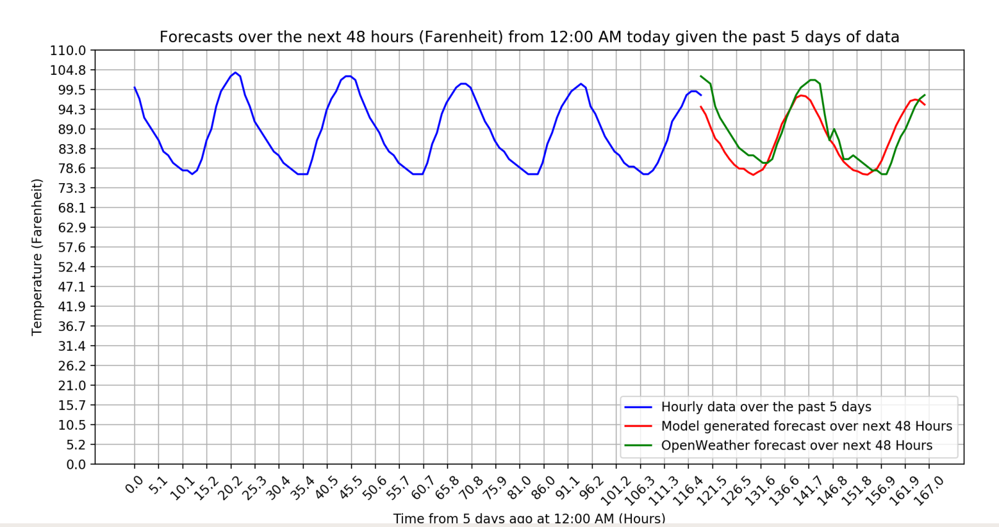

# Weather-Prediction
A program to predict weather given data from the past 5 days. Uses time series modeling to produce a multi-step forecast for 48 hours past the current time.



## System Prerequisites
Recommended usage is through Anaconda, this will allow the user to import the given prerequistes easily.
- Python 3
- Matplotlib
- Numpy, Pandas, statsmodels

## Usage
Run the program with the following code:
```python
python3 main_app.py
```

## Program Detail
- Asks user for a certain zipcode. Some zipcodes aren't available due to the API like 41376.
- Perform API calls in the background to gather the data and compile it into a local file.
    - First API call is to convert zipcode into latitude/longitude using [https://www.zipcodeapi.com](https://www.zipcodeapi.com). Latitude/longitude is needed for gathering weather data using our chosen weather data API.
    - Gathers the last 5 days worth of weather data from the entered zipcode using [https://openweathermap.org](https://openweathermap.org) in hourly intervals.
- Uses the `AutoReg` model from `statsmodels.tsa` to make weather predictions for the next 48 hours.
    - Model initially is trained over true, observed data (hourly data over past 5 days).
    - Since `AutoReg` predicts the next timestep in the future, for each timestep in the next 48 hours, the model would predict a new temperature.
    - Then, the model would treat each new temperature as ground truth data, which allows multi-step forecasting over the next 48 hours.
- Produces a styled matplotlib graph of the results.